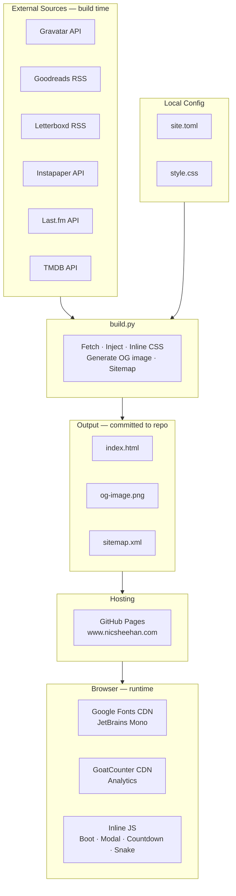

# Site Architecture

nicsheehan.com is a fully headless static site. All content is fetched from external services at build time — there is no CMS, no runtime server, no database.

## How it works

## Key decisions

- **No runtime server** — GitHub Pages serves static files only. Zero infrastructure to maintain.
- **Build-time content** — all external data is fetched by `build.py` and baked into `index.html`. The browser never calls any external data APIs.
- **Inline CSS** — `style.css` is inlined into `index.html` at build time, eliminating a render-blocking request.
- **Minimal JS** — no framework. Inline scripts only: boot sequence, item detail modal, countdown timer, Snake easter egg.
- **Graceful degradation** — all external fetches are wrapped in try/except. If a source fails, existing content is preserved and the build continues.
