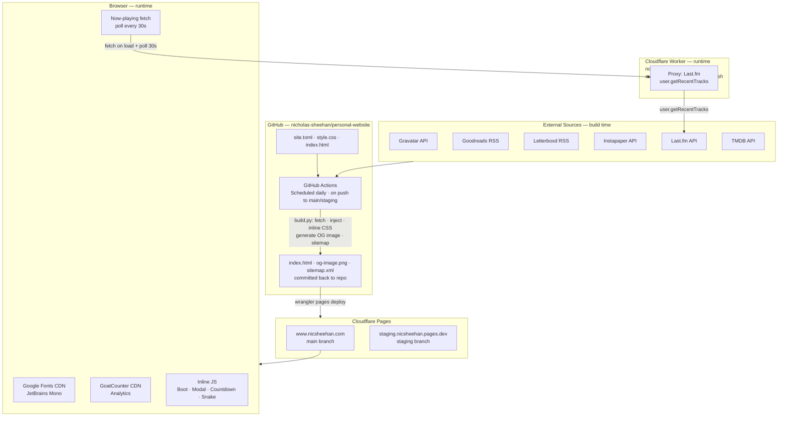

# Site Architecture

nicsheehan.com is a fully headless static site. All content is fetched from external services at build time — there is no CMS, no runtime server, no database.

## How it works

```mermaid
flowchart TD
    subgraph sources["External Sources — build time"]
        GV[Gravatar API]
        GR[Goodreads RSS]
        LB[Letterboxd RSS]
        IP[Instapaper API]
        LF[Last.fm API]
        TM[TMDB API]
    end

    subgraph repo["GitHub — nicholas-sheehan/personal-website"]
        CFG[site.toml · style.css · index.html]
        GA[GitHub Actions\nScheduled daily · on push to main/staging]
        OUT[index.html · og-image.png · sitemap.xml\ncommitted back to repo]
    end

    subgraph hosting["Cloudflare Pages"]
        PROD[www.nicsheehan.com\nmain branch]
        STG[staging.nicsheehan.pages.dev\nstaging branch]
    end

    subgraph browser["Browser — runtime"]
        GF[Google Fonts CDN\nJetBrains Mono]
        GC[GoatCounter CDN\nAnalytics]
        JS[Inline JS\nBoot · Modal · Countdown · Snake]
        NP[Now-playing fetch\npoll every 30s]
    end

    subgraph worker["Cloudflare Worker — runtime\nnow-playing.b-tonic.workers.dev\nauto-deployed via CI on main push"]
        CW[Proxy: Last.fm\nuser.getRecentTracks]
    end

    sources --> GA
    CFG --> GA
    GA -->|"build.py: fetch · inject · inline CSS\ngenerate OG image · sitemap"| OUT
    OUT -->|"wrangler pages deploy"| hosting
    PROD --> browser
    NP -->|"fetch on load + poll 30s"| CW
    CW -->|"user.getRecentTracks"| LF
```

## Key decisions

- **No runtime server** — Cloudflare Pages serves static files only. Zero infrastructure to maintain.
- **Build-time content** — all external data is fetched by `build.py` and baked into `index.html`. The browser calls no external data APIs directly, with one exception below.
- **Cloudflare Worker (now-playing)** — a small Cloudflare Worker at `now-playing.b-tonic.workers.dev` proxies Last.fm `user.getRecentTracks` at runtime. The browser polls it every 30 seconds to show a live "currently playing" strip. Auto-deployed by CI on push to `main` (`wrangler deploy` in the deploy job); `LASTFM_API_KEY` is stored as a Cloudflare secret, not a GitHub Secret. CORS allows `www.nicsheehan.com` and `staging.nicsheehan.pages.dev`.
- **Inline CSS** — `style.css` is inlined into `index.html` at build time, eliminating a render-blocking request.
- **Minimal JS** — no framework. Inline scripts only: boot sequence, item detail modal, countdown timer, Snake easter egg, now-playing fetch.
- **Graceful degradation** — all external fetches are wrapped in try/except. If a source fails, existing content is preserved and the build continues.

## Content Security Policy

A `Content-Security-Policy` response header is set via a **Cloudflare Transform Rule** (dashboard → `nicsheehan.com` → Rules → Transform Rules → Modify Response Header → "Security headers" rule). It applies to all requests matching hostname `www.nicsheehan.com`.

**Rule: adding any new external resource requires updating the CSP.** If a new data source, CDN, font, or analytics tool is added, its origin must be whitelisted in the appropriate directive or the browser will silently block it in production.

| Directive | Value | Reason |
|-----------|-------|--------|
| `default-src` | `'self'` | Fallback for unlisted resource types |
| `script-src` | `'self' 'unsafe-inline' static.cloudflareinsights.com gc.zgo.at` | Inline JS (build-time) + Cloudflare Analytics beacon + GoatCounter |
| `connect-src` | `'self' now-playing.b-tonic.workers.dev cloudflareinsights.com nicsheehan.goatcounter.com` | Now-playing Worker fetch + Cloudflare Analytics ping + GoatCounter ping |
| `img-src` | `'self' data: *.gravatar.com images.gr-assets.com i.gr-assets.com s.gr-assets.com letterboxd.com a.ltrbxd.com image.tmdb.org` | Avatar (Gravatar), book covers (Goodreads), film posters (Letterboxd + TMDB) |
| `style-src` | `'self' 'unsafe-inline' fonts.googleapis.com` | Inline CSS (build-time) + Google Fonts stylesheet |
| `font-src` | `'self' fonts.gstatic.com` | JetBrains Mono font files (served by Google) |
| `frame-ancestors` | `'none'` | Prevent clickjacking (iframe embedding) |

`X-Frame-Options: SAMEORIGIN` is set in the same Cloudflare rule. It duplicates the `frame-ancestors 'none'` CSP directive for older browsers that predate CSP support (IE8+). `X-Content-Type-Options: nosniff` is intentionally omitted from the rule — Cloudflare Pages already sets it by default.
