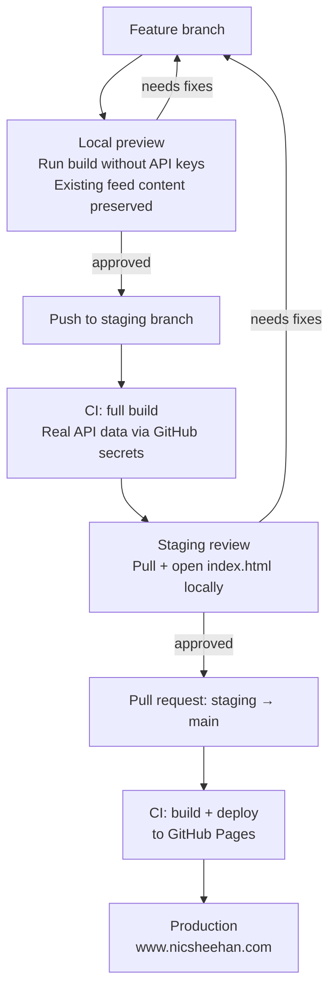

# Development Pipeline

## Branch strategy

| Branch | Purpose | Deploys to |
|--------|---------|------------|
| `main` | Production — what is live | www.nicsheehan.com |
| `staging` | Pre-production — full build with real data, no deploy | Local preview only |
| Feature branches | Active development — one per iteration | Local preview only |

**`main` is protected.** No direct pushes. All changes flow through a pull request.

## How changes move to production

## Stage 1 — Local preview

Run `python3 build.py` without API keys. The build re-inlines CSS and updates timestamps but preserves existing feed content between markers. Open `index.html` in your browser.

**Use for:** CSS changes, HTML structure, JavaScript behaviour, design work.

## Stage 2 — Staging review

Push to the `staging` branch. GitHub Actions runs a full build using real API secrets and commits the result back to `staging`. Pull the branch locally and open `index.html`.

**Use for:** data pipeline changes, new API fields, new content sources.

## Stage 3 — Production

Open a pull request from `staging` to `main`. Review the diff. Merge. GitHub Actions builds and deploys to GitHub Pages automatically.

## CI behaviour by branch

| Branch | Build job | Deploy job |
|--------|-----------|------------|
| `main` | ✅ runs | ✅ runs |
| `staging` | ✅ runs | ❌ skipped |
| Feature branches | ❌ not triggered | ❌ not triggered |
