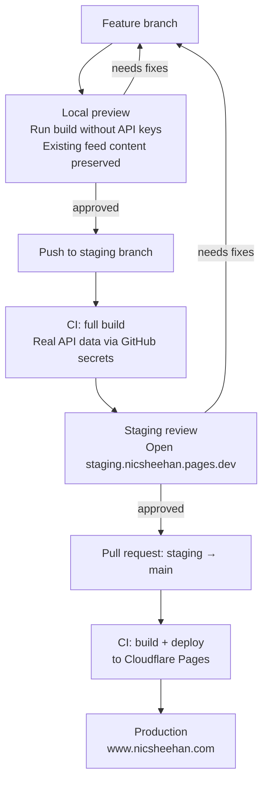

# Development Pipeline

## Branch strategy

| Branch | Purpose | Deploys to |
|--------|---------|------------|
| `main` | Production — what is live | www.nicsheehan.com (Cloudflare Pages) |
| `staging` | Pre-production — full build with real data | staging.nicsheehan.pages.dev (Cloudflare Pages preview) |
| Feature branches | Active development — one per iteration | Local preview only |

**Never push directly to `main`.** All changes flow through a pull request. The build bot pushes feed updates directly as part of CI via a dedicated deploy key (`BOT_DEPLOY_KEY`) — this is the only exception. Bot commits use `[skip ci]` to prevent retriggering the workflow.

## How changes move to production

```mermaid
flowchart TD
    FB[Feature branch] --> LP[Local preview\nRun build without API keys\nExisting feed content preserved]
    LP -->|approved| STG[Push to staging branch]
    STG --> CI1[CI: full build\nReal API data via GitHub secrets]
    CI1 --> SR[Staging review\nOpen staging.nicsheehan.pages.dev]
    SR -->|approved| PR[Pull request: staging → main]
    PR --> CI2[CI: build + deploy\nto Cloudflare Pages]
    CI2 --> PROD[Production\nwww.nicsheehan.com]

    LP -->|needs fixes| FB
    SR -->|needs fixes| FB
```

## Stage 1 — Local preview

Run `python3 build.py` without API keys. The build re-inlines CSS and updates timestamps but preserves existing feed content between markers. Open `index.html` in your browser.

**Use for:** CSS changes, HTML structure, JavaScript behaviour, design work.

## Stage 2 — Staging review

Push to the `staging` branch. GitHub Actions runs a full build using real API secrets, commits the result back to `staging`, and deploys to Cloudflare Pages. Open the staging preview URL in your browser.

**Use for:** data pipeline changes, new API fields, new content sources.

Push to the `staging` branch and open `staging.nicsheehan.pages.dev` in your browser once CI completes.

## Stage 3 — Production

Open a pull request from `staging` to `main`. Review the diff. Merge. GitHub Actions builds and deploys to Cloudflare Pages automatically.

## CI behaviour by branch

| Branch | Build job | Deploy job |
|--------|-----------|------------|
| `main` | ✅ runs | ✅ runs → www.nicsheehan.com |
| `staging` | ✅ runs | ✅ runs → staging.nicsheehan.pages.dev |
| Feature branches | ❌ not triggered | ❌ not triggered |
